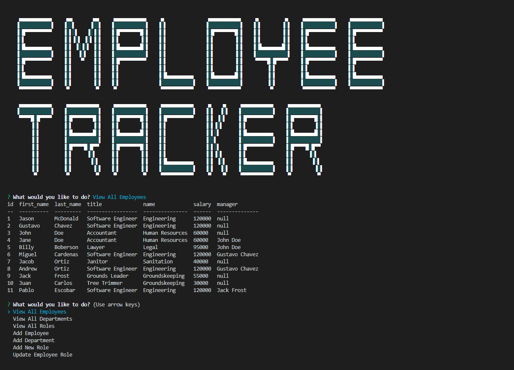

# Employee-Tracker

```
Link to preview video: https://drive.google.com/file/d/1-dB_apGygdeD6Bg6XSZqHuTIJEXdNU_K/view?usp=sharing
```
## Description

Employee Tracker is an application that allows the user to manage employee information with a locally hosted database.
Using mysql packages and inquirer, the user can view departments, roles, and employee tables. They can also add departments, roles, and employees. As well as update employee role information. 

## Running the Program

```
node server.js
```

## Installing Dependencies
```
npm install
```
## Preview Image
